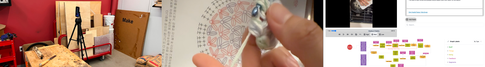
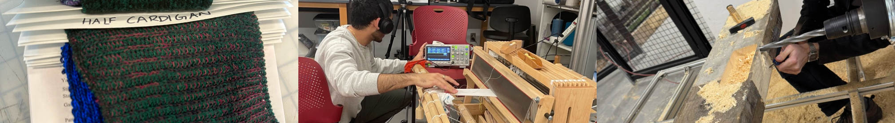

# _Fabricated Efficiency_: Reflections on Fabrication Research in the Real World
**Originally submitted to CHI'26 workshop, _From Papers to the Real World: Making Fabrication Research Matter_[^1]**

In this position paper, I argue that fabrication research's dissemination problem is fundamentally an efficiency problem: the community has drawn on computing's normative efficiency metrics while ignoring the values embedded in real-world fabrication practices. Drawing on my own research with craftspeople, I reflect on three engagement strategies (Discussing with, Testing with, Learning with) that reveal how makers (not researchers) evaluate tools through relational, pedagogical, and embodied lenses rather than computational optimization, suggesting alternative pathways for fabrication research. At the CHI'26 workshop, From Papers to the Real World, I hope to discuss these tensions with fellow researchers and how fabrication research can prioritize real-world impacts.

## 1 Introduction

> "What was good for scientists was good for science, and what was good for science was good for society.... [Scientists] argued their position as a mere article of faith... grounded upon the fiction of an autonomous science destined by fate always to serve the public interest." — Noble [17]

Noble critiques how scientists often claim that the pursuit of knowledge will automatically benefit society. Decades later, fabrication research faces a parallel challenge. Just as scientists may assume their work to naturally serve public interests, fabrication researchers often assume that publishing novel techniques, tools, and systems will automatically lead to adoption by makers in the real world. By makers, I refer to a broad category with both hobbyist and professional practitioners engaging in a "workmanship of risk" [19], designing and creating physical artifacts; makers include (among others) woodworkers, textile artists, and ceramicists as well as machine operators, industrial engineers, and architects.

Fabrication researchers have made leaps and bounds with faster laser cutting algorithms [20] and material-efficient 3D printing [8], envisioning technical advances translating to real-world impact on the maker community. However, many of these contributions remain confined to academic publications, demo videos, and lab prototypes.

Research in computing fields such as Human-Computer Interaction (HCI) has undoubtedly advanced the accessibility and capabilities of fabrication processes in many ways [5, 9]. Computing, however, also brings its own notions of "efficiency" into fabrication research. As a result, researchers have utilized these computational efficiencies as a means of evaluation, relying on metrics such as algorithmic complexity [1] and model accuracy [21]. As Noble [17] demonstrated in his analysis of computer numerical control (CNC) machines and production, these metrics are never neutral. They reflect specific values and interests rooted in modernism and industrialism [23], often prioritizing managerial control over the expertise of makers on the shop floor [10]. Historically, when such research gets put into practice without considering to makers' values, there has been resistance: Luddites in Manchester breaking machinery in response to automated weaving looms[^2] and recent conflicts over humanoid robots in Hyundai's U.S. factories.[^3]

This position paper argues that fabrication research's dissemination problem is fundamentally an efficiency problem: we are optimizing for and evaluating the wrong values. While fabrication research optimizes for computing's normative efficiency metrics, makers in the real world operate within different value systems: "Woodworking sounds really cool until you find out it's 90% sanding".[^4] Weaving a tapestry can be regarded as a meditative practice of shedding, picking, beating, and repeat. Baking delicious pastries requires patient kneading of the dough, feeling the texture become smooth and elastic (and then giving the dough time to rest!). These practices are shaped by tacit knowledge [18], reflective action [22], and correspondences with materials [11] that give the practice its meaning and value.

Importantly, the adoption of techniques, tools, and systems developed by researchers is not due to a lack of maker understanding but the inability to imagine their integration with existing practices. When fabrication research only builds on computing's existing norms of efficiency, we ignore the social, pedagogical, ecological, and even planetary dimensions that shape and enable fabrication workflows, limiting its real-world adoption.

To understand what efficiency looks like in real-world fabrication practices and how fabrication research could disseminate to makers, I examine three engagement strategies from my own work on computational tools for (and from) craft practices: Discussing with, Testing with, and Learning with. Each strategy in an iterative cycle reveals the differing values of makers, exploring dissemination pathways that prioritize real-world impacts of fabrication research.

## 2 Dissemination Pathways

### 2.1 Discussing with... (Figure 1)

*Figure 1: Buildings, workspaces, and deployment areas from my ethnography with craftspeople.*

Discussing with makers is perhaps the most common approach to conducting fabrication research in HCI: formative studies [24, 25], needfinding [6, 16], and probe studies [12, 15]. Typically, these are 30 to 90 minute interviews and discussions with "experts" to elicit and surface their needs. As an aside, identifying a fabrication "expert" can be difficult and uncomfortable as the typical maker is constantly learning and practicing. This approach is often useful, as creating tools without involving users (or specifying "users") would distance the research from those it is intended to serve.

However, the quality of these discussions depends critically on how and where they happen. In my (recently!) conditionally accepted paper, *Convivial Fabrication* [4], I conducted an ethnography with craftspeople through semi-structured interviews. These were not rigid data capture exercises but discussions that evolved organically. I began with broad questions about the craftsperson's techniques, tools, and perspective on sustainability in their practice, but as the study progressed, the inquiry sharpened toward the relationships between craftspeople, tools, and materials.

Going to makers' spaces in person proved far more impactful than Zoom meetings or phone calls (although, remote calls are often unavoidable). One interview took place in a community garden with the participant's sculptures where their child played in the dirt nearby (the recording had occasional interruptions of "don't eat that!"). Another occurred in a workshop within a shared manufacturing building where I walked past a lighting fixture manufacturing facility on the ground floor and took an inconspicuous elevator to the participant's workspace. A third was in the participant's teaching weaving studio where the soft rhythmic beating of students' floor looms provided a gentle ambiance (and extra interference when transcribing the recording later).

These settings revealed something university lab interviews never could: the situatedness of fabrication practice. Makers eagerly shared their pieces and machines, integrated with the context of their lives. The context often matters as much, if not more than the content of the interviews themselves, revealing how fabrication research should integrate not just with the workflows but with spaces, routines, and relationships.

### 2.2 Testing with... (Figure 2)

*Figure 2: Artifacts from my user studies and testing with craftspeople.*

Testing research prototypes with makers through user studies and evaluations is standard practice within HCI. But what makers value in these tests often differs from what researchers measure. In a recent design probe study (redacted as under review), my collaborators and I developed an AI-powered prototype for designers and manufacturers to collaborate. Woodworkers interacted with a small device via think-aloud and gestures to document their workflows.

I was initially uncertain whether participants would earnestly engage with an AI-powered research prototype. One maker I reached out declined my study participation request; they shared that they did not to take any part in AI-related research (which I found very justified). Among those who did participate, responses varied dramatically. One maker who participated in the study described the device as a child in the workshop, needing constant supervision and distracting from their usual workflow. Yet another participant found it easy to use, describing the system as similar to a student asking questions and they even paused the study when they saw another maker in the workshop using a miter saw incorrectly. These metaphors of child and student provide an interesting framing. Makers were not evaluating research tools primarily on speed, accuracy, or computational efficiency; instead, they were assessed through a pedagogical lens: Does the tool fit into the workshop? Can I teach it to understand what I do? Does it build on my expertise?

In another project, *(De)composing Craft* [2], we developed an interface for crocheters to share their workflows and improvisations with other experts. Testing revealed that participants valued the interface for its ability to showcase nuances, the stuff that made their work theirs. Participants had a vested interest in the artifacts that featured their work as compared to the generic ones passed to them. One participant went over time because they insisted on refining the interface to best represent their practice, not because the study required it but because any representation of their work matters to them. This suggests dimensions of efficiency we rarely measure in fabrication research: the tool's capacity to honor individual creative agency, to support teaching and learning relationships, to integrate with the social dynamics of workshop spaces. A "successful" fabrication tool is not necessarily the fastest one; perhaps it could be the one that makers build a relation with and extends (not replaces) their expertise and practice.

### 2.3 Learning with... (Figure 3)

*Figure 3: Artifacts from learning knitting, weaving, and robotic timber fabrication with expert craftspeople.*

Learning with is perhaps the most lacking (and most difficult) dissemination strategy in fabrication research. It requires being part of the community rather than an outsider peering in (see Lave [13] and Lave and Wenger [14]). I started my PhD unfamiliar with textile fabrication, so I took a knitting course to learn how to use a mechanical knitting machine. This required dealing with needle breakages, yarn tangles, and, of course, sitting for hours to knit a 10cm swatch. This felt slow; it was much much slower than writing software, conducting interviews, or running user studies. But it was immensely valuable — I began to get a glimpse into textile fabrication: the texture of the yarn's slubs and sounds from the knitting carriage. When I eventually transitioned to computing-driven fabrication tools such as the Shima Seiki knitting machine or TC2 digital loom, they became far less intimidating due to the familiarity with the underlying and principled craft practice [3].

This embodied learning experience was one of the motivations for my shifting of research focus after my first year. Had I only observed knitters and weavers, I may have focused on the computing-driven automation or optimization efficiencies, rather than realizing that the "bugs" of fabrication workflows are not inefficiencies but features of the craft where learning, creativity, and collaboration live.

Currently, I am working on an ethnography with an architecture research group in Copenhagen that works with robots and 3D printers to fabricate with reclaimed materials. I initially knew nothing about robotic fabrication, so I am learning. The goal is not sit outside taking notes but contribute to the projects and learn alongside (not just from) the expert makers. Rather than a "take-take" attitude commonly critiqued of ethnographic methods, I hope this strategy will be bidirectional: contribute to their research while building dimensions into my own work. Learning with reveals that the "efficiency" of fabrication knowledge cannot be captured in documentation alone; it must be experienced through participation. Tools designed without this understanding may technically work but feel alien to makers — they solve problems that do not exist while ignoring the ones that do.

## 3 Concluding Thoughts and Questions

The makers I have worked with are not generally against computing — they understand that computing has its benefits. But their concerns are perhaps best explained by Mark Webb: "Sometimes I feel like my job at home is putting things into machines and taking things out of machines".[^5] Many (but not all) makers are open to computational tools designed for them and the values embedded in their practices (e.g., collaborative, creative, improvisational) rather than tools adapted from large-scale industrial manufacturing processes that treat fabrication as extractive production.

The three engagement strategies I described (Discussing with, Testing with, Learning with) represent different levels of commitment from both researchers and makers and could reveal new pathways for fabrication research deployed in the real world. These engagements suggest that fabrication research's dissemination problem could be an efficiency problem. We have fabricated our own sense of what counts as efficient, optimizing for computational metrics while ignoring the values that make fabrication meaningful to makers.

For fabrication research to matter beyond publications, we must (re-)examine our reviewing and evaluation practices. What should reviewers in fabrication research look for? How many researchers have worked in manufacturing plants, textile studios, or community workshops for extended periods of time, and how can the review process value that experience? How do we prioritize research that complements maker's existing workflows over imaginary ones? Noble [17] critiqued the assumption that scientific progress naturally benefits society; fabrication research risks the same hubris Ian Malcolm from Crichton [7] warned against: *"Your scientists were so preoccupied with whether or not they could that they didn't stop to think if they should."*

## References

[1] Bugra Alkan and Seth Bullock. 2021. Assessing operational complexity of manufacturing systems based on algorithmic complexity of key performance indicator time-series. Journal of the Operational Research Society 72, 10 (2021), 2241–2255.

[2] Ritik Batra, Lydia Kim, Ilan Mandel, Amritansh Kwatra, Steven J Jackson, and Thijs Roumen. 2025. (De)composing Craft: An Elementary Grammar for Sharing Expertise in Craft Workflows. arXiv preprint arXiv:2506.10891 (2025).

[3] Ritik Batra, Narjes Pourjafarian, Samantha Chang, Margaret Tsai, Jacob Revelo, and Cindy Hsin-Liu Kao. 2025. texTENG: Fabricating Wearable Textile-Based Triboelectric Nanogenerators. In Proceedings of the Augmented Humans International Conference 2025. 124–138.

[4] Ritik Batra, Roy Zunder, Amy Cheatle, Amritansh Kwatra, Ilan Mandel, Thijs Roumen, and Steven J Jackson. 2026. Convivial Fabrication: Towards Relational Computational Tools For and From Craft Practices. arXiv preprint arXiv:2602.04393 (2026).

[5] Patrick Baudisch, Stefanie Mueller, et al. 2017. Personal fabrication. Foundations and Trends® in Human–Computer Interaction 10, 3–4 (2017), 165–293.

[6] Samuelle Bourgault, Alejandro Aponte, Megumi Ondo, Emilie Yu, and Jennifer Jacobs. 2025. WORM: Programming Collaborative Robots Through Manual Actions for Craft-Aligned Digital Fabrication. In Proceedings of the 38th Annual ACM Symposium on User Interface Software and Technology. 1–19.

[7] Michael Crichton. 1993. Jurassic Park. Cresset Press, London, England.

[8] Ahmed Elkaseer, Stella Schneider, and Steffen G Scholz. 2020. Experiment-based process modeling and optimization for high-quality and resourceefficient FFF 3D printing. Applied Sciences 10, 8 (2020), 2899.

[9] Neil Gershenfeld. 2012. How to make almost anything: The digital fabrication revolution. Foreign Aff. 91 (2012), 43.

[10] Ivan Illich and Anne Lang. 1973. Tools for conviviality. Harper & Row New York.

[11] Tim Ingold. 2020. Correspondences. John Wiley & Sons.

[12] Jasmine Jones, Ye Yuan, and Svetlana Yarosh. 2021. Be consistent, work the program, be present every day: exploring Technologies for Self-Tracking in early recovery. Proceedings of the ACM on Interactive, Mobile, Wearable and Ubiquitous Technologies 5, 4 (2021), 1–26.

[13] Jean Lave. 2019. Learning and everyday life: access, participation and changing practice. Cambridge University press, Cambridge, United Kingdom New York, NY, USA.

[14] Jean Lave and Etienne Wenger. 2001. Legitimate peripheral participation in communities of practice. In Supporting lifelong learning. Routledge, 121–136.

[15] Bokyung Lee, Gyeol Han, Jundong Park, and Daniel Saakes. 2017. Consumer to creator: How households buy furniture to inform design and fabrication interfaces. In Proceedings of the 2017 CHI Conference on Human Factors in Computing Systems. 484–496.

[16] Nikolas Martelaro and Wendy Ju. 2017. The needfinding machine. In Proceedings of the Companion of the 2017 ACM/IEEE International Conference on Human-Robot Interaction. 355–356.

[17] David Noble. 2017. Forces of production: A social history of industrial automation. Routledge.

[18] Michael Polanyi. 2009. The tacit dimension. In Knowledge in organisations. Routledge, 135–146.

[19] David William Pye. 1968. The nature and art of workmanship. Vol. 47. Cambridge.

[20] Xingfei Ren, Jinwei Fan, Ri Pan, and Kun Sun. 2023. Modeling and process parameter optimization of laser cutting based on artificial neural network and intelligent optimization algorithm. The International Journal of Advanced Manufacturing Technology 127, 3 (2023), 1177–1188.

[21] Mika Salmi, Kaija-Stiina Paloheimo, Jukka Tuomi, Jan Wolff, and Antti Mäkitie. 2013. Accuracy of medical models made by additive manufacturing (rapid manufacturing). Journal of Cranio-Maxillofacial Surgery 41, 7 (2013), 603–609.

[22] Donald A Schön. 2017. The reflective practitioner: How professionals think in action. Routledge.

[23] James C Scott. 2020. Seeing like a state: How certain schemes to improve the human condition have failed. yale university Press.

[24] Ticha Sethapakdi, Daniel Anderson, Adrian Reginald Chua Sy, and Stefanie Mueller. 2021. Fabricaide: Fabrication-aware design for 2d cutting machines. In Proceedings of the 2021 CHI Conference on Human Factors in Computing Systems. 1–12.

[25] Jasper Tran O'Leary, Chandrakana Nandi, Khang Lee, and Nadya Peek. 2021. Taxon: a Language for Formal Reasoning with Digital Fabrication Machines. In The 34th Annual ACM Symposium on User Interface Software and Technology. 691–709.

[^1]: https://fabricationresearch.wordpress.com/
[^2]: https://www.historic-uk.com/HistoryUK/HistoryofBritain/The-Luddites/
[^3]: https://www.reuters.com/business/world-at-work/hyundai-motors-korean-union-warns-humanoid-robot-plan-sees-threat-jobs-2026-01-22/
[^4]: https://x.com/Duderichy/status/1935313693866180976
[^5]: https://interconnected.org/home/2026/02/06/sanding
