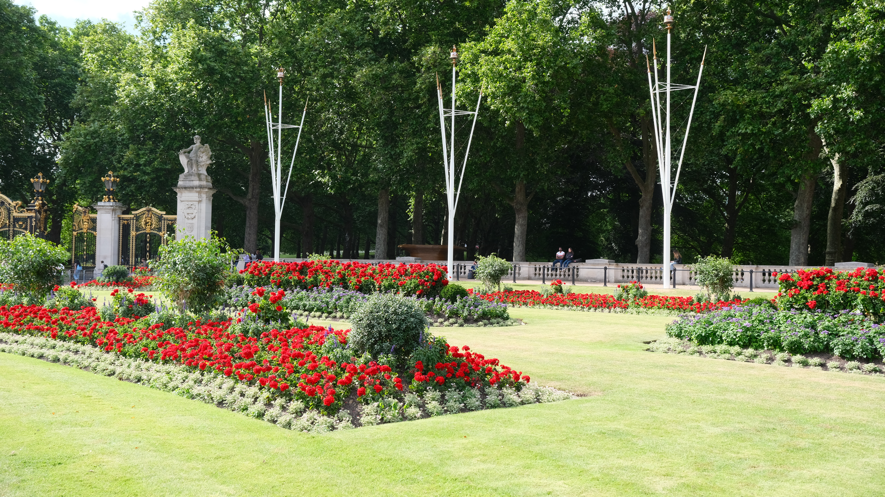

> *"What makes a garden is interesting. It's personal. Things are organized and orderly, but with a touch of chaos around the edges."* –[Joel Hooks](https://joelhooks.com/digital-garden/)

The *Submit* button has become all too familiar. From *Send* in the email composition of Gmail to *Submit Assignment* in the common university Canvas portal, we have become accustomed to a kind of finality when sharing our ideas and work with others (and often, this is very stress-inducing). Even here, the reader (in this case, you) only has a partial (and limited) window into the mind of the author (me) while writing this. This results in what I call an **artifact-centric** model.

Here is why an artifact-centric model sucks. Recall the days of high school or even university-level mathematics: right before the exam, the instructor would say something similar to *"Please show all your work so we can give partial credit."* As someone who went through a STEM degree, I cannot tell you how many times this saved my grade and had it been an artifact-centric model, I would perhaps not be here today. But why is "showing the work" even important? It shows that you understand the concepts for the grader, sure, but looking beyond our example, it creates a documentation artifact that can help the author reflect on their progress and help the reader gain a meta-understanding of how the author came to their final artifact. Software engineers who use Git for version control are also familiar with the benefits of having a well-documented (and organized) code base for collaboration, knowledge sharing, and debugging.

During my endless procrastinating, I stumbled upon this concept of a *digital garden* (for more, check out [Joel Hooks](https://joelhooks.com/digital-garden/), [Amy Hoy](https://stackingthebricks.com/how-blogs-broke-the-web/), [Tom Critchlow](https://tomcritchlow.com/2019/02/17/building-digital-garden/)). Rather than relying on Substack, Medium, and other blogging platforms to share final writing artifacts, I have been thinking more about how I can share partial ideas, thoughts, and brainstorms with others and for myself to reflect on. A garden analogy for this is perfect – some plants are small and growing, others are more developed and prominent, and sadly, some die when forgotten. I still have not figured out how to do this with this kind of medium but a *community* garden also invites fellow travelers to come by and perhaps contribute seeds back to the garden. This is my attempt to embody some of these attributes for both whimsical and serious ideas (the best ones are a bit of both).

I'll end this text here for now to avoid rambling and then having to edit down. The somewhat "head fake" of all this is to be able to practice writing with my own voice in ways that are concise, transparent, and hopefully useful for someone else down the road too. As I write more articles, as per the original ethos of digital gardens, I will also add some more curation of articles here but for now, enjoy the chaos of articles (some of which are just titles). If you have any questions/ideas/thoughts, please feel free to shoot me an email at `ritik at infosci dot cornell dot edu`

Current motifs I'm thinking about and want to write more about:
- #craft
- #computing
- #documentation
- #abstractions
- (some flavor and perhaps hot takes of) #AI

### text graveyard
*Throughout this digital garden, I will try experimenting with various ways of capturing and sharing the process behind each article. Below, I added any phrases/sentences that I wrote and then commented out in Markdown (but still referenced for writing what is above).*

```
you are a high school student in an English class. All your classmates are cheating on their final paper using ChatGPT 

(I will surely write more about this from a theoretical perspective in a future article)
Let me give you an example of why less *artifact-centric* are important.

A less artifact-centric view can have many applications. The analogy that jumps to mind is one of a student taking a paper-pencil math test.

Discussions, brainstorms, conversations – they all are a bit different. Here are just some adjectives I can think of that show 

Real-world sharing is much different 

As an HCI researcher, I stare at the *Record Changes* 

(maybe for non-business circles, we can define this as artifact-centricity).
These past few years have been a lot of reflection and with that reflection, I have wanted to document my journey (some fleeting, some unfinished, some incoherent). I stumbled upon the wonderful platform of Obsidian 

Three paragraphs
Writing writing writing

Motivation
- writing has become this extremely arduous "submit" button as a researcher
- but what I'm hoping to do is work through ideas publicly (and some that I wish weren't so public)
- what is this for: sharing half-baked ideas with others and working through them with myself
- obsidian (and more increasingly, my journal) has become a place for my to gather ideas and while these are great, they remain difficult to collaborate and show the process
- papers as the final artifact don't seem quite right (and a version diff is also another misdirect)

What is a "digital garden"
- I stumbled upon this idea of a "digital garden" 

Mapping the garden
- to avoid taking this analogy too far (and perhaps, too cringe) but still giving the layout, let's imagine 
```