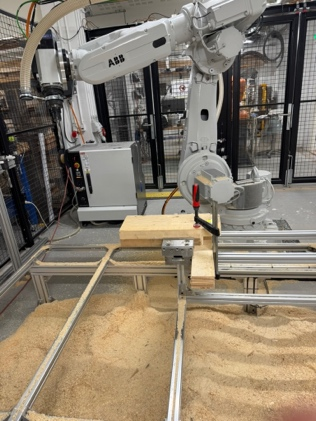
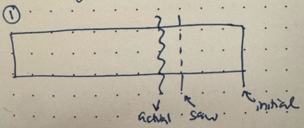
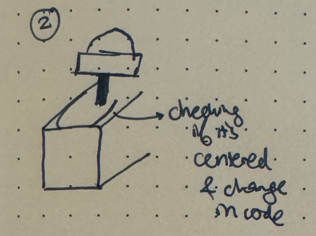
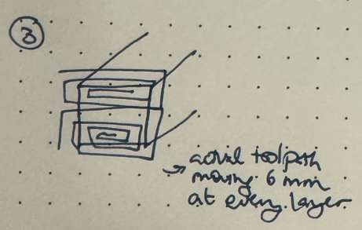
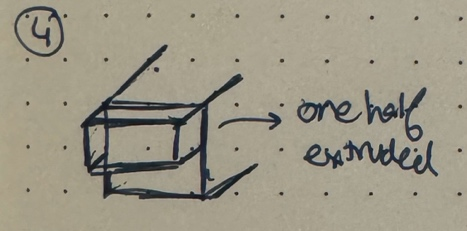
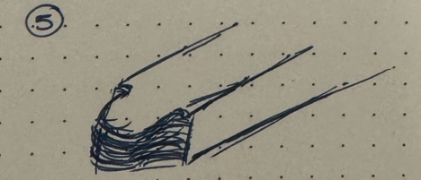
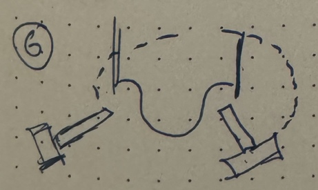
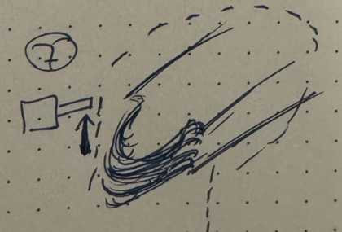

A few weeks before I flew out to #copenhagen, I had caught up with a
friend doing research in computer vision (not HCI/fabrication). After
describing my research interests in materials-driven fabrication and
sustainability, he was quiet for a second and then asked me, *“Isn’t
manufacturing fully automated now by robots and such? Why do we need the
humans in those kinds of workflows?”* I had no experience with robotic
manufacturing to be able to respond confidently – until I started at
#cita.

At CITA, I was put on one of the existing projects, *ReShelter*. One of
the tasks assigned to me was to support one of the other researchers
(pseudonym, JH) in the robotic fabrication of a forest shelter using #reclaimed
wood beams from multiple sources such as an earlier CITA research
project (*RawLam*).

On the first day, I was introduced to their fabrication lab with the
giant (and intimidating) ABB-branded robotic arm with a spindle at the
end for milling. JH had shown me the Rhino file with the entire shelter
design, and everything seemed perfect and ready to go. He showed me the
Grasshopper workflow to generate the CAM files and transporting them to
the robot controller. Then, we would “jog” (or manually move) the robot
end effector to a position close to the starting position of the CAM
toolpath and let the controller adjust to the exact position.

Outside of the fabrication lab is a giant pile of reclaimed wood,
covered in tarp and wood scraps to keep the tarp from flying away. This
was the wood that we would be using for the project. The tarp did not
seem particularly protective of the wood. In fact, when we first removed
the tarp to retrieve certain beams, rainwater hidden in the folds of the
tarp gushed out, partially onto the wood beams. JH was not concerned –
reclaimed wood will constantly change anyway. This attitude was one that
I was not familiar with – *materials will change and we will adapt.*
Coming from using 3D printers or laser cutters, where materials were
standardized and CAD/CAM were defined, I was uneasy with the comfort
that the researchers had with materials that constantly change. What
shocked me more is how JH told me that we do not have any extra pieces
– every timber beam was specifically designated for a part of the final
structure without any extras.

Of course, the piles of #timber themselves were also challenging to sort
through as well. Every timber had markings with a number (sometimes on
both ends, sometimes only on one) and JH and I would spend time taking
pieces off the pile to retrieve a few beams and then put them back to
avoid leaving them exposed and spreading the materials on the courtyard
of the campus. When I asked JH how he chooses the order of which
materials to mill, he loosely described how beams with similar cut
patterns are easier to do together and once you get into a groove, it is
easy to rinse and repeat with the same setup, fixturing, and sequence of
operations.

JH had taught me the basics of using the robotic mill. After a few mornings
of working with JH, we got into a groove; JH would set up the CAM
files, and I would operate the controller for milling. The process would
begin with fixturing – the timber could not move despite the immense
force being applied onto the timber. For the shorter pieces that could
not fit into both the clamps, we had to improvise as shown on the left.

Most of the other pieces (at least so far) followed some variation of
the following steps (apologies for the crude drawings):

1.  Sawing to Size

    

    The reclaimed lumber beams were not made to size. The way that the
    beams were prepared was by taking two pieces of reclaimed timber and
    gluing them together. However, the pieces were (more or less) cut to
    similar size. They were labeled prior to my arrival of which beams
    were associated with which parts of the final structure (therefore,
    if a beam needed to be longer that was already predetermined). There
    were still pieces that were too long or even pieces that contain two
    of the final beams. The robot mill would take too long with that
    much excess wood – so we had to go manual and just use the saw to
    cut (-ish) to size. We would leave a bit extra for the robot to make
    precise cuts but if we didn’t do this, the robot fabrication would
    take forever (wasting time).

2.  *Profile* Check  

    
    
    Profile check was a check without any action on the timber beam. The
    grasshopper code had an offset slider, and we measured to see how
    centered the profile cut would be as per the timber beam, we had. We
    would use the calipers and move the spindle slowly along the
    toolpath. If it was off slightly (under 1-2mm), we would ignore it.
    But the centering was more off, JH would adjust the code to offset
    (“better to change code, not physical setup”).

3.  *End Cut*

    
    
    Then,
    we would begin the actual milling process. The robot would go in a
    spiral pattern and JH would program it to be in the air for a few
    rounds and we would change the speed based on what initially felt
    like “vibes.” After a few rounds of milling where I would be
    cautious and run fabrication at 50% speed, I realized that the
    slower speed would have a higher likelihood of causing the timber to
    shake in the jig. Faster speeds would be louder but often result in
    cleaner cuts. Any splinters that resulted from the cuts would be
    okay – JH shared that these artifacts (better term?) are normal and
    could be cleaned up later.

4.  *Pocket*

    
    
    For
    a reason that I’m still unsure about, the end cut would be split up
    into another step called “profile” that made the difference between
    the top/half of the beam more substantially different as per the CAD
    model. We wouldn’t need to move the robot between steps 3 and 4.

5.  *Profile*

    

    Next was the actual profile cut. I would have to jog the robot to a
    location that is close to the starting point of the toolpath. If I
    didn’t do this, the robot would try to take an “optimal” path to the
    starting point that could hit the piece of wood itself or the actual
    frame. Also, there was an interesting issue that JH was worried
    about. There was a plastic connector for a wire and the spindle
    itself that cracked. That meant that if there was too much pressure
    applied (or if the wire was pulled too hard/fast), the wire would be
    yanked out. That meant that any movement of the robot arm had to be
    done extremely carefully and we would have to go to the robot and
    pull the wire to reduce how taut the wire was. Although there is a
    maintenance person for the robot, they are not on site (in
    Stockholm) and therefore, it’s faster and more convenient for the
    researchers to try and resolve the issues themselves.

6.  *Wings*

    
    
    The wings were a “dangerous” toolpath due to the wire issue. But the
    milling itself was super-fast; it would be just an arch movement,
    but the first time we did it, the wire got yanked and we had to
    spend some time fixing it. So usually, we run this path at 25-50%
    speed.

7.  *Trace*

    
    
    The final milling step was mostly for assurance that if the joints were
    not cut perfectly, they could still be slotted together during the
    final assembly. This cut was just two lines. It was interesting that
    even upon fabrication completion, the assembly feels daunting with
    all the things need to be adjusted. The actual fabrication itself is
    such a small part of the process (and there are inevitable mistakes)
    – the precision happens in the planning and then adapting the pieces
    to “work” happens during assembly. On the wall of the fabrication
    lab is a spreadsheet printout with every beam to be fabricated along
    with notes specifying reminders that could be addressed during
    assembly.

While robots have immense capabilities to increase the precision of
fabrication, they also have high risk. What if the #fixturing isn’t done
well and the wood shakes? What if the robot arm turns in a weird way and
hits the piece (potentially damaging the robot)? What if a robot part
breaks (and you’re pressed for time)? While the robot seems
indestructible, I realized how fragile it really is. Every piece of wood
took about 2-3 hours, contingent on everything going smoothly. I’m
curious to observe more about this tension and negotiation between
computational tools ( #computing ) and the human (not operator, but collaborator) and
how they both come to reach a “steady state” of #fabrication.
