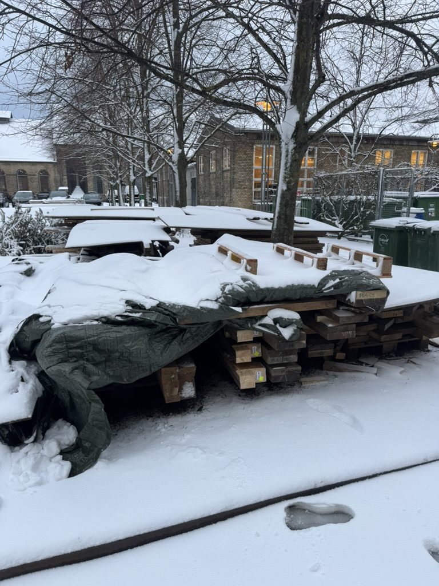
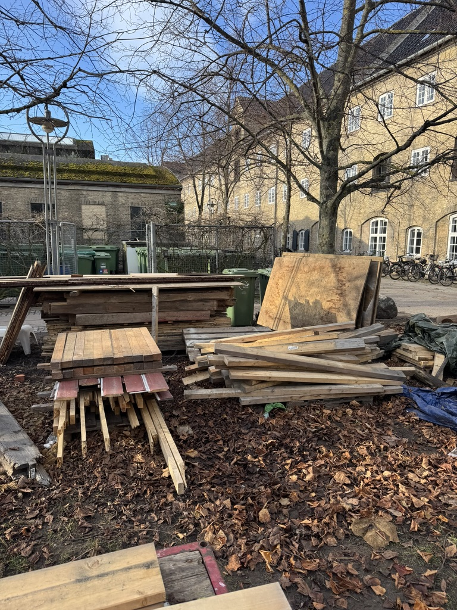
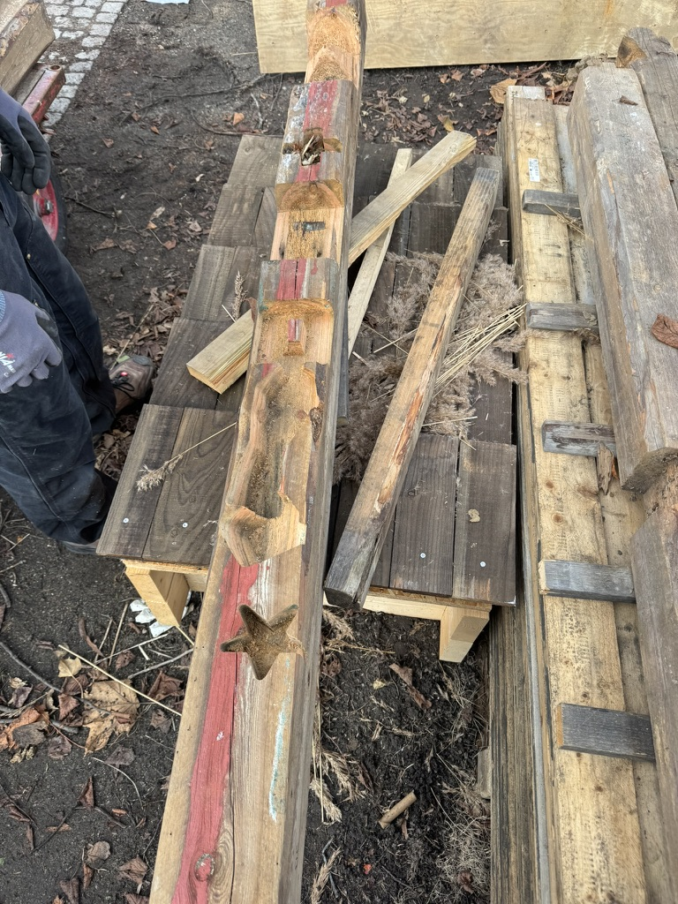
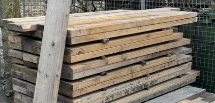
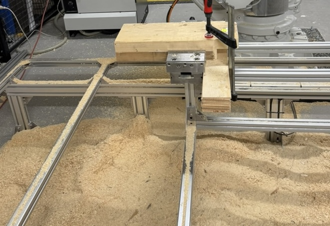
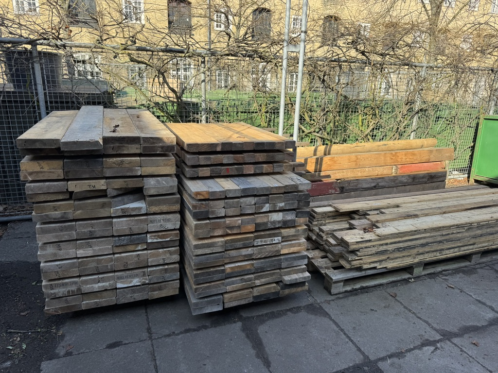

I've been thinking a lot about #stuff and how it becomes #trash . No, I do not mean the candy wrappers or beer cans commonly seen on every sidewalk in New York (although, maybe I should think about that too). Here, I mean the #timber offcuts cast in giant dumpsters next to building construction sites. I mean the buckets of #fabric pieces on the textile manufacturing plant floor that had rips and inconveniently shaped. And I even mean the little transistors and resistors in the Fitbit left in the deepest and darkest corner of everyone's bedside drawer chest. This "stuff" used to be critical to the sculpture, but now that sculpture has lost its importance: the stuff became trash. At what point, does stuff become trash? Is it when we just simply do not have the physical space for them (think, the old desk chair you left outside your apartment when you were moving)? Is it when we give up on their imperfections (your bike's creaks start becoming screeches)? Or is it just because the newest stuff was more appealing (that new iPhone just has a better camera)? And perhaps more frustratingly, is it when another person decides that your stuff should now be trash ([planned obsolescence](https://en.wikipedia.org/wiki/Planned_obsolescence))?

JH (pseudonym) and I had some related conversations when tasked to move the timber from the lawn to another part of campus. Campus had required us to reduce the amount of space that the timber pieces took and to move them a few meters away so they would be less hidden. For context, below are some pictures of what initial mess looked like (across a few different climates). Safe to say, it was not a very welcoming task.

Some of the timber was the stuff of old and stuff of active research projects. Some were just offcuts and pieces meant to keep the tarp from blowing off timber. Some had unknown sources and more unknown uses (maybe a passerby threw them onto the pile of timber?). As with any big #cleaning task (particularly one that results in a downsized space), every piece brings up the question: stuff or trash? 

One piece (shown below), had been used in coursework for architecture students to learn how to use a CNC, but still had this beautiful red color that could be used for something. It was hard to imagine throwing a piece like this away (don't worry, we didn't). Pallets were saved and stacked on the existing campus pile. I always thought pallets were low-quality wood, but to my surprise, the [EU-standard EPAL pallets](https://www.epal-pallets.org/eu-en/load-carriers/epal-euro-pallet) are fairly durable and last a long time. Worth keeping them around.

Not every timber piece was as lucky though; of course, there was plenty of trash. Some pieces had mold. Other pieces had just been outside for so long that they were brittle and crumbling at the touch. Such was deemed trash and placed into the campus' wood dumpster (presumably, it would be turned into MDF or incinerated as [90% of Denmark's wood gets incinerated for energy production](https://www.sciencenordic.com/architecture-denmark/a-future-built-from-waste-wood/2287488#:~:text=Wood%20is%20not%20just%20wood,Christian%20Andersen's%20House'%20in%20Odense.)).

When stacking the timber pieces in the new location, stuff was not considered equal. Some of the stuff was placed higher on the stack. Some stuff was tragically placed in the back. This was at JH's and my whim: whatever we thought would be useful in the near future would earn a spot in the front and top (maybe with some selfishness considered). Some stuff was considered important for our own personal projects; both of us imagined using them for something around the house or as practice pieces to learn new machines. Stacking also from a logistics side was also no easy task. Stuff that was similarly shaped and sized was placed together. Larger stuff had to be placed on the bottom to avoid the stacks from toppling over. We had previously compared this to ["Tower of Hanoi"](https://en.wikipedia.org/wiki/Tower_of_Hanoi), trying to move large and small around until they were somewhat optimally ordered. Stacking ended up being a complex and multifaceted problem.

I'm embarrassed to admit: I had mistakenly deemed some offcuts as trash. But JH insisted they remained stuff and I realized why when we started stacking. Below you might be able to see why; the skinny offcuts were used as spacers. The spacers were important for somewhat even drying and hopefully preventing mold (which as you heard, was not always possible). So some stuff can lose its purpose can get a new purpose to prevent being trash.

Maybe a bit tangential but worth discussing briefly: cleaning was a constant consideration for the research team. Every Friday (or most Fridays), the supervisor would do a fabrication lab check and the researchers would ensure that the space was clean. No wires on the floor for people to trip on. No timber pieces blocking the hallways (warranting this lawn/timber stacking situation). There is this balance between a space that is messy (see sawdust below the robotic mill below) and that needs to be pristine (and therefore perfectly safe). Some rules are meant to be broken and we do the best we can with what needs to be done.

This is not meant to be an angry "WE NEED LESS STUFF AND LESS TRASH" – it's more of a reflection on how the decision framework for stuff to become trash is not as simple as it looks, particularly for people who enjoy making sculptures from stuff. I think this does not just apply to physical stuff too. What about digital stuff? If #code is stuff, when does that become trash? Who is responsible for determining if code needs to be updated/replaced (JH and I chatted about this in relation to cultural heritage architecture research)? It would be interesting to see what the world would look like if more people thought this thoughtfully and carefully about their stuff when deciding whether it should be trash or a new kind of stuff.

Of course, I had to end with the picture of the final timber stack :)

